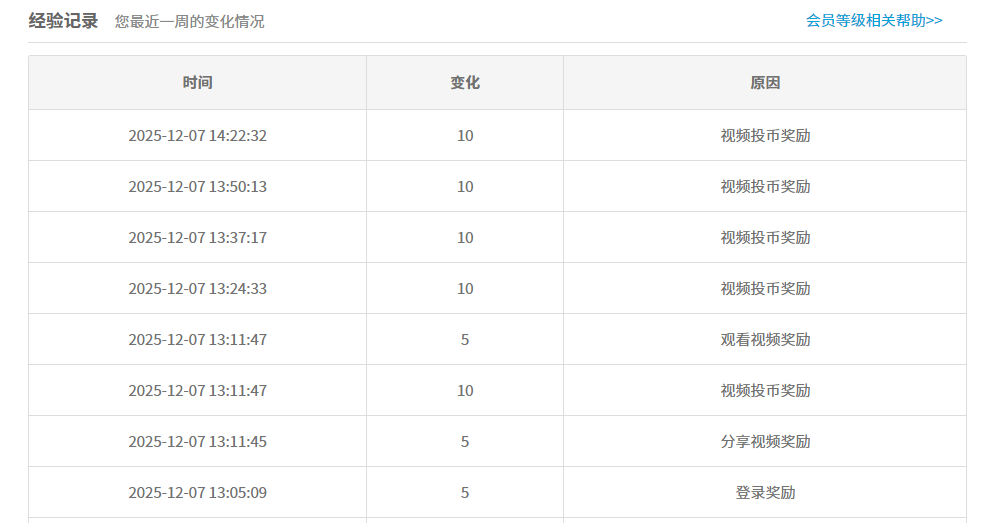
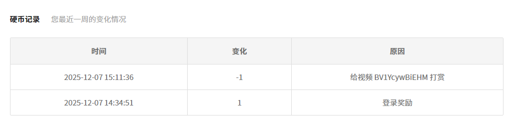
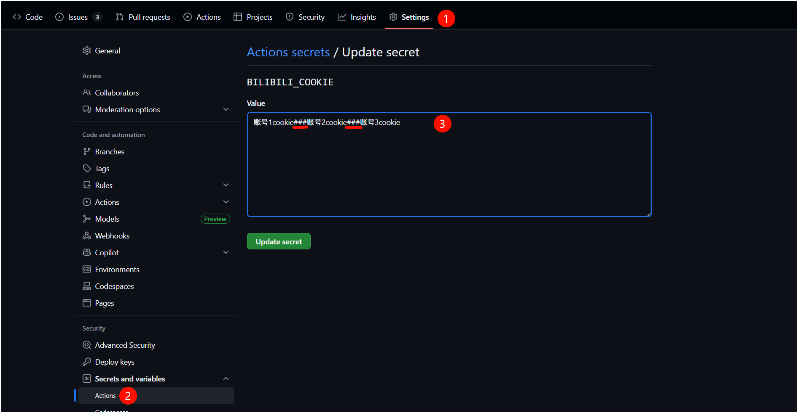
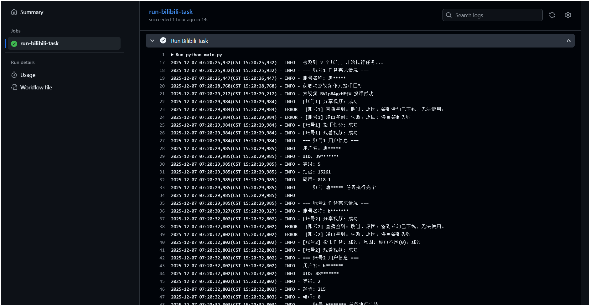
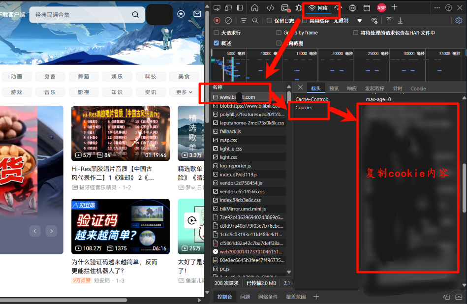

# bilibili_checkin

## 项目简介
这是一个自动化打卡脚本，旨在帮助用户完成B站的每日签到任务，包括分享视频、观看视频、~~直播签到~~、漫画签到、自动投币。通过使用GitHub Actions，可以实现每日自动运行脚本，完成签到任务并获取相应的奖励。  

## 包含功能:
1. **任务签到**：登录奖励、分享奖励、观看视频、~~直播签到~~(活动已下线,功能暂时保留)、漫画签到、视频投币等任务；
2. **支持多账号**：可在单个工作流中为多个账号执行任务；
3. **安全可靠**：敏感信息安全传递：支持通过环境变量读取cookie；
4. **自动化运行**：结合GitHub Actions实现自动化运行，执行日志结果清晰；
5. **支持通过 PushPlus 推送任务运行结果**，方便及时获取通知；
6. **手动触发**：(每日奖励只能领取一次，故触发多次即使执行成功结果也不会变化)。

## 签到奖励：
完成签到任务可获取到`硬币、经验值` 。

## 使用方法:  
1. Fork本项目到你的GitHub仓库中。
2. 在你的仓库 `Settings -> Secrets and variables -> Actions` 中，添加以下 `Repository secrets`：

 | 名称 | 是否必需 | 说明 | 默认值 |
|---|---|---|---|
| `BILIBILI_COOKIE` | **是** | B站Cookie。多账号用 `###` 分隔。 | 无 |
| `PUSH_PLUS_TOKEN` | **否** | PushPlus 的 Token，用于推送通知。 | 无 |
| `TASK_CONFIG` | **否** | 任务执行控制，用逗号分隔。可选值: `live_sign`, `manga_sign`, `share_video`, `add_coin` | `live_sign,manga_sign,share_video,add_coin` |
| `COIN_ADD_NUM` | **否** | 每日投币数量。 | `1` |
| `COIN_SELECT_LIKE`| **否** | 投币时是否点赞。`1` 为是，`0` 为否。 | `1` |
| `COIN_VIDEO_SOURCE`| **否** | 投币视频来源。`dynamic` (动态)，`ranking` (排行榜)。 | `dynamic` |

   **多账号Cookie配置示例:**
   cookie账号1###cookie账号2###cookie账号3
   

3. 启用GitHub Actions，Fork的仓库默认是关闭workflow的，需要手动开启。   

## 执行结果查看  
可以在workflows里查看执行日志的输出结果。**如果你配置了推送，也会在手机上收到任务报告。**

## Cookie获取：  
打开浏览器网页登录B站，然后进入开发人员工具(F12)，查看网络响应标头就能找到Cookie。  

## 注意事项:  
1. Cookie要包含`bili_jct`, `SESSDATA`, `DedeUserID`字段；
2. 建议先手动运行测试；
3. 可以根据需要修改cron表达式调整执行时间；  
4. 请确保Cookie有效，修改密码或退出登录会导致Cookie失效；  
5. 请勿在任何位置明文泄露你的Cookie以防账号被盗；  
6. **为了保护用户隐私，执行日志中的用户名等信息将进行脱敏处理（例如 `U******e`），请放心使用**；
7. 本项目仅供学习交流使用，请勿滥用。

## 常规问题：  
1. 关于分享视频：  
- 这个分享操作是调用B站的分享接口，实际上只是模拟了一次分享行为；
- 不会真实分享到任何地方，只是为了完成每日任务获取经验值；
- B站会记录这个分享行为，但不会在任何地方显示出来。

2. 关于观看视频：  
- 程序里指定的视频BV号是随意挑选的(侵联删!)，不指定特定BV号也是可以的；
- 当前代码指定BV号主要是为了保证稳定性，因为随机视频可能会遇到:  
-- 视频已下架  
-- 视频需要会员才能观看   
-- 视频有年龄限制等情况  
- 当前默认优先使用动态视频列表的第一个视频，只有获取失败时才用指定的固定BV号。  

3. 关于投币任务：
- 投币任务会根据你的配置（投币数量"1"默认开启）自动为视频投币;  
- 如果你的硬币余额不足，脚本会自动跳过投币任务，打印日志“硬币不足，跳过”; 
- 如果当天投币已达上限，脚本会自动终止投币，打印日志“今日投币上限已满，终止投币”； 
- 投币目标视频可以选择“动态”或“排行榜”来源，具体由`COIN_VIDEO_SOURCE`环境变量控制； 
- 投币任务失败不会影响其他任务的执行。

4. 关于任务执行一致性：
- 所有账号会严格按照`TASK_CONFIG`配置执行任务，未配置按默认执行； 
- 即使某些任务被跳过(如未配置、硬币不足、活动下线)，也会明确打印日志，方便排查; 
- PushPlus推送失败不影响整体任务成功，为非必需配置； 
- 每个账号只要有一个登录后任务成功，则该账号整体成功；
- 如果账号登录失败或所有任务都失败，则该账号失败；
- 多账号时，只要有一个账号失败，整体失败；
- 整体失败则会触发任务失败通知(需开启邮件通知)。

## 贡献指南
欢迎提交Issue和Pull Request来改进本项目。

分支说明：
- [main](https://github.com/Dangks/bilibili_checkin/tree/main)：主线分支，包含最新稳定版本代码  
- [dev](https://github.com/Dangks/bilibili_checkin/tree/dev)：开发分支，包含开发中的问题修改和新功能测试  
**请注意，直接向 `main` 分支发起的 PR 将不会被接受。

## 许可证
本项目采用[MIT](./LICENSE)许可证。  

## Todo:
- [ ] 网页获取的cookie时效问题，~~最短只有三天，后续考虑解决长期登录验证~~，只要不在网页再次登录就是长期有效，暂不纳入计划，本人运行半年以上cookie有效。 
- [ ] Issue采纳的问题和新功能，有时间会继续完善。

## 感谢
感谢所有为本项目提出建议、反馈问题和提交代码的朋友！  
特别感谢以下 GitHub 用户/社区成员的贡献（排名不分先后）：  
- 感谢[风月同天](https://github.com/ZZ0YY)的PR  
- [所有 Issue/PR 参与者]  
- 以及每一位使用、测试和推广本项目的用户！ 

你的支持让项目不断完善和进步，欢迎继续提出宝贵意见或提交 Pull Request！
